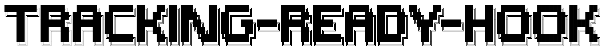

<p align="center">
  
</p>

# Is Tracking ready Hook

Tiny **327 bytes** `React` Hook that notify you when GA or GTM is loaded in your React Component

Use `requestAnimationFrame` to check when the tracking code has been loaded. There's a pre-defined `timeOut` (default `5000`) that will stop the checking automatically and report an error if you need for example to log it somewhere.

## :package: Installation

```bash
npm install tracking-ready-hook --save
```

## :rocket: Load
s
```js
// using es modules
import useTrackingIsLoaded from 'tracking-ready-hook'

// common.js
const useTrackingIsLoaded = require('tracking-ready-hook')

```

Or use script tags and globals.

```html
<script src="https://unpkg.com/tracking-ready-hook"></script>
```

And then grab it off the global like so:

```js
const useTrackingIsLoaded = trackingReadyHook.default;
```

## :bulb: Usage

Let's assume you want to sent some data to GA or to the `dataLayer` but in order to do that you need to wait for GA or GTM to be available in `window`.

```javascript
function App() {
  const [status, error] = useIsEvilLoaded();
  return (
    <div className="App">
      {status ? <p>Loaded</p> : <p>Not Loaded</p>}
      {error ? <p>Error: {error.message}</p> : null}
    </div>
  );
}
```

> Maybe more useful: run inside `useEffect` Hook or `onClick` to send data to `dataLayer`

```javascript

function App() {
  const [status, error] = useIsEvilLoaded();
  useEffect(() => {
    if (status) {
      window.dataLayer.push({
			ecommerce: {
				currencyCode: 'USD',
				impressions: [{foo: 'bar'}]
			}
		});
    }
  })
  return (
    <div className="App">
      Please track me!!!
    </div>
  );
}

```

## API

#### `useIsEvilLoaded(timeout: Number);` Default `timeout` 5000

Returns an `Array` of `status: Boolean` and `error: Error Object`

## Tests

`npm test`

## Legals

Released under MIT license.